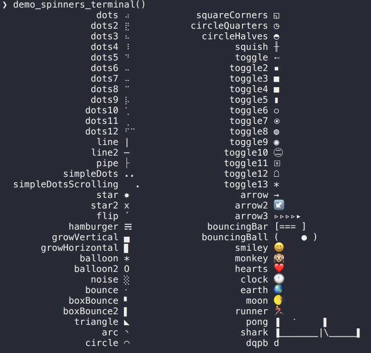

```{r, setup, echo = FALSE, message = FALSE}
knitr::opts_chunk$set(
  comment = "#>",
  fig.path = "man/figures/"
)
```

# Installation

Install the stable version from CRAN:

```r
install.packages("cli")
```

Install the development version from GitHub:

```r
source("https://install-github.me/r-lib/cli")
```

# Usage
 
```{r}
library(cli)
```

```{r echo = FALSE, results = "hide"}
options(crayon.enabled = TRUE)
options(crayon.colors = 256)
crayon::num_colors(forget = TRUE)
```

## Unicode characters

Inspired by (and mostly copied from) the
[figures](https://github.com/sindresorhus/figures) JavaScript project.

```{r symbols, echo = FALSE}
rpad <- function(x, width) {
  w <- nchar(x, type = "width")
  paste0(x, strrep(" ", width - w))
}
chars <- rpad(paste0(symbol, "\t", names(symbol)), 25)
if (length(chars) %% 2) chars <- c(chars, "")
chars <- paste(
  sep = "   ",
  chars[1:(length(chars)/2)],
  chars[(length(chars)/2 + 1):length(chars)])
cat(chars, sep = "\n")
```

## Spinners

See `list_spinners()` and `get_spinner()`. From the awesome
[cli-spinners](https://github.com/sindresorhus/cli-spinners#readme)
project.



## Rules

Simple rule

```{r rule, render=cli:::knit_print.html}
rule()
```

Double rule

```{r rule-double, render=cli:::knit_print.html}
rule(line = 2)
```

Bars

```{r rule-bars, render=cli:::knit_print.html}
rule(line = "bar2")
rule(line = "bar5")
```

Left label

```{r rule-left, render=cli:::knit_print.html}
rule(left = "Results")
```

Centered label

```{r rule-center, render=cli:::knit_print.html}
rule(center = " * RESULTS * ")
```

Colored labels

```{r rule-color-label, render=cli:::knit_print.html}
rule(center = crayon::red(" * RESULTS * "))
```

Colored label and line

```{r rule-color, render=cli:::knit_print.html}
rule(center = " * RESULTS * ", col = "red")
```

Colored line

```{r rule-color-line, render=cli:::knit_print.html}
rule(center = " * RESULTS * ", line_col = "red")
```

Custom line

```{r rule-line-custom, render=cli:::knit_print.html}
rule(center = "TITLE", line = "~")
```

More custom line

```{r rule-line-custom-2, render=cli:::knit_print.html}
rule(center = "TITLE", line = "~-", line_col = "blue")
```

Even more custom line

```{r rule-line-custom-3, render=cli:::knit_print.html}
rule(center = crayon::bgRed(" ", symbol$star, "TITLE", symbol$star, " "),
  line = "\u2582", line_col = "orange")
```

## Boxes

Default box

```{r box, render=cli:::knit_print.html}
boxx("Hello there!")
```

Change border style

```{r box-border-style, render=cli:::knit_print.html}
boxx("Hello there!", border_style = "double")
```

Multiple lines

```{r box-lines, render=cli:::knit_print.html}
boxx(c("Hello", "there!"), padding = 1)
```

Padding

```{r box-padding, render=cli:::knit_print.html}
boxx("Hello there!", padding = 1)
boxx("Hello there!", padding = c(1, 5, 1, 5))
```

Margin

```{r box-margin, render=cli:::knit_print.html}
boxx("Hello there!", margin = 1)
boxx("Hello there!", margin = c(1, 5, 1, 5))
boxx("Hello there!", padding = 1, margin = c(1, 5, 1, 5))
```

Floating

```{r box-floating, render=cli:::knit_print.html}
boxx("Hello there!", padding = 1, float = "center")
boxx("Hello there!", padding = 1, float = "right")
```

Text color

```{r box-color, render=cli:::knit_print.html}
boxx(crayon::cyan("Hello there!"), padding = 1, float = "center")
```

Backgorund color

```{r box-bgcolor, render=cli:::knit_print.html}
boxx("Hello there!", padding = 1, background_col = "brown")
boxx("Hello there!", padding = 1, background_col = crayon::bgRed)
```

Border color

```{r box-border-color, render=cli:::knit_print.html}
boxx("Hello there!", padding = 1, border_col = "green")
boxx("Hello there!", padding = 1, border_col = crayon::red)
```

Label alignment

```{r box-label-align, render=cli:::knit_print.html}
boxx(c("Hi", "there", "you!"), padding = 1, align = "left")
boxx(c("Hi", "there", "you!"), padding = 1, align = "center")
boxx(c("Hi", "there", "you!"), padding = 1, align = "right")
```

A very customized box

```{r box-customized, render=cli:::knit_print.html}
star <- symbol$star
label <- c(paste(star, "Hello", star), "  there!")
boxx(
  crayon::white(label),
  border_style="round",
  padding = 1,
  float = "center",
  border_col = "tomato3",
  background_col="darkolivegreen"
)
```

## Trees

You can specify the tree with a two column data frame, containing the
node ids/labels, and the list of their children.

```{r tree, render=cli:::knit_print.html}
data <- data.frame(
  stringsAsFactors = FALSE,
  package = c("processx", "backports", "assertthat", "Matrix",
    "magrittr", "rprojroot", "clisymbols", "prettyunits", "withr",
    "desc", "igraph", "R6", "crayon", "debugme", "digest", "irlba",
    "rcmdcheck", "callr", "pkgconfig", "lattice"),
  dependencies = I(list(
    c("assertthat", "crayon", "debugme", "R6"), character(0),
    character(0), "lattice", character(0), "backports", character(0),
    c("magrittr", "assertthat"), character(0),
    c("assertthat", "R6", "crayon", "rprojroot"),
    c("irlba", "magrittr", "Matrix", "pkgconfig"), character(0),
    character(0), "crayon", character(0), "Matrix",
    c("callr", "clisymbols", "crayon", "desc", "digest", "prettyunits",
      "R6", "rprojroot", "withr"),
    c("processx", "R6"), character(0), character(0)
  ))
)
tree(data, root = "rcmdcheck")
```

An optional third column may contain custom labels. These can be colored
as well:

```{r tree-color, render=cli:::knit_print.html}
data$label <- paste(data$package,
  crayon::blurred(paste0("(", c("2.0.0.1", "1.1.1", "0.2.0", "1.2-11",
    "1.5", "1.2", "1.2.0", "1.0.2", "2.0.0", "1.1.1.9000", "1.1.2",
    "2.2.2", "1.3.4", "1.0.2", "0.6.12", "2.2.1", "1.2.1.9002",
    "1.0.0.9000", "2.0.1", "0.20-35"), ")"))
  )
roots <- ! data$package %in% unlist(data$dependencies)
data$label[roots] <- crayon::cyan(crayon::italic(data$label[roots]))
tree(data, root = "rcmdcheck")
```

# License

MIT © RStudio
