# cli

> Helpers for Developing Command Line Interfaces

[](https://travis-ci.org/r-lib/cli)
[](https://ci.appveyor.com/project/gaborcsardi/cli)
[](http://www.r-pkg.org/pkg/cli)
[](http://www.r-pkg.org/pkg/cli)
[](https://codecov.io/github/r-lib/cli?branch=master)

A suite of tools to build attractive command line interfaces
(CLIs), from semantic elements: headers, lists, alerts, paragraphs,
etc. Supports theming via a CSS-like language. It also contains a
number of lower level CLI elements: rules, boxes, trees, and
Unicode symbols with ASCII alternatives. It integrates with the
crayon package to support ANSI terminal colors.

---

-   [Features](#features)
-   [Installation](#installation)
-   [Building a command line
    interface](#building-a-command-line-interface)
    -   [Alerts](#alerts)
    -   [Text](#text)
    -   [Paragraphs](#paragraphs)
    -   [Auto-closing containers](#auto-closing-containers)
    -   [Headings](#headings)
    -   [Interpolation](#interpolation)
    -   [Inline text formatting](#inline-text-formatting)
    -   [Lists](#lists)
    -   [The status bar](#the-status-bar)
-   [Theming](#theming)
    -   [Tags, ids and classes](#tags-ids-and-classes)
    -   [Generic containers](#generic-containers)
    -   [Theming inline markup](#theming-inline-markup)
-   [CLI messages](#cli-messages)
-   [Subprocesses](#subprocesses)
-   [Utility functions](#utility-functions)
    -   [ANSI colors](#ansi-colors)
    -   [Console capabilities](#console-capabilities)
-   [Non-semantic CLI](#non-semantic-cli)
    -   [Unicode characters](#unicode-characters)
    -   [Rules](#rules)
    -   [Boxes](#boxes)
    -   [Trees](#trees)
    -   [Spinners](#spinners)
-   [License](#license)

<!-- README.md is generated from README.Rmd. Please edit that file -->
Features
========

-   Build a CLI using semantic elements: headings, lists, alerts,
    paragraphs.
-   Theming via a CSS-like language.
-   Terminal colors via the [crayon](https://github.com/r-lib/crayon)
    package.
-   Create CLI elements in subprocesses, using the
    [callr](https://github.com/r-lib/callr) package.
-   All CLI text can contain interpreted string literals, via the
    [glue](https://github.com/tidyverse/glue) package.

Installation
============

Install the stable version from CRAN:

``` r
install.packages("cli")
```

Building a command line interface
=================================

``` r
library(cli)
```

To start building a CLI, so can simply start using the `cli_*` functions
to create various CLI elements. Their exact formatting depends on the
current theme, see ‘Theming’ below.

Alerts
------

Alerts are typically short messages. cli has four types of alerts
(success, info, warning, danger) and also a generic alert type:

``` asciicast
cli_alert_success("Updated database.")
```

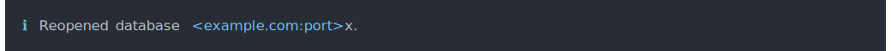

``` asciicast
cli_alert_info("Reopened database.")
```


``` asciicast
cli_alert_warning("Cannot reach GitHub, using local database cache.")
```


``` asciicast
cli_alert_danger("Failed to connect to database.")
```

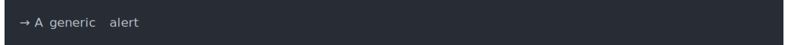

``` asciicast
cli_alert("A generic alert")
```


Text
----

Text is automatically wrapped to the terminal width.

``` asciicast
cli_text(cli:::lorem_ipsum())
```


Paragraphs
----------

Paragraphs break the output. The default theme inserts an empty line
before and after paragraphs, but only a single empty line is added
between two paragraphs.

``` asciicast
fun <- function() {
  cli_par()
  cli_text("This is some text.")
  cli_text("Some more text.")
  cli_end()
  cli_par()
  cli_text("Already a new paragraph.")
  cli_end()
}
fun()
```


`cli_end()` closes the latest open paragraph (or other open container).

Auto-closing containers
-----------------------

If a paragraph (or other container, see ‘Generic containers’ later), is
opened within a function, cli automatically closes it at the end of the
function, by default. So in the previous example the last `cli_end()`
call is not needed. Use `.auto_close = TRUE` in `cli_par()` to leave the
paragraph open after its calling function returns.

Headings
--------

cli suppports three levels of headings. This is how they look in the
default theme. The default theme adds an empty line before headings, and
an empty line after `cli_h1()` and `cli_h2()`.

``` asciicast
cli_h1("Heading 1")
```


``` asciicast
cli_h2("Heading 2")
```


``` asciicast
cli_h3("Heading 3")
```


Interpolation
-------------

All cli text is treated as a glue template, with special formatters
available (see the ‘Inline text formatting’ Section):

``` asciicast
size <- 123143123
dt <- 1.3454
cli_alert_info(c(
  "Downloaded {prettyunits::pretty_bytes(size)} in ",
  "{prettyunits::pretty_sec(dt)}"))
```

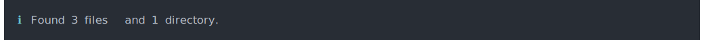

Inline text formatting
----------------------

To define inline markup, you can use the regular glue braces, and after
the opening brace, supply the name of the markup formatter with a
leading dot, e.g. for emphasised text, you use `.emph`. Some examples
are below, see `?"inline-markup"` for details.

``` asciicast
fun <- function() {
  cli_ul()
  cli_li("{.emph Emphasized} text")
  cli_li("{.strong Strong} importance")
  cli_li("A piece of code: {.code sum(a) / length(a)}")
  cli_li("A package name: {.pkg cli}")
  cli_li("A function name: {.fn cli_text}")
  cli_li("A keyboard key: press {.kbd ENTER}")
  cli_li("A file name: {.file /usr/bin/env}")
  cli_li("An email address: {.email bugs.bunny@acme.com}")
  cli_li("A URL: {.url https://acme.com}")
  cli_li("An environment variable: {.envvar R_LIBS}")
}
fun()
```

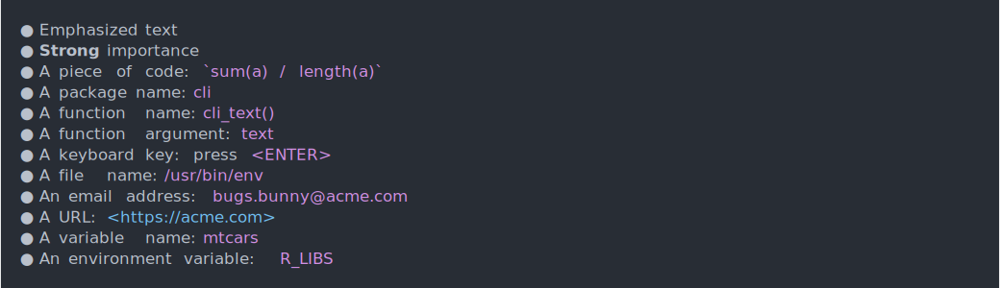

To combine inline markup and string interpolation, you need to add
another set of braces:

``` asciicast
dlurl <- "https://httpbin.org/status/404"
cli_alert_danger("Failed to download {.url {dlurl}}.")
```


Lists
-----

cli has three types of list: ordered, unordered and definition lists,
see `cli_ol()`, `cli_ul()` amd `cli_dl()`:

``` asciicast
cli_ol(c("item 1", "item 2", "item 3"))
```

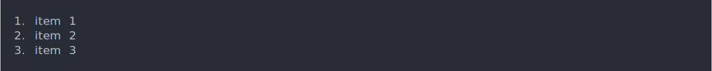

``` asciicast
cli_ul(c("item 1", "item 2", "item 3"))
```


``` asciicast
cli_dl(c("item 1" = "description 1", "item 2" = "description 2",
         "item 3" = "description 3"))
```

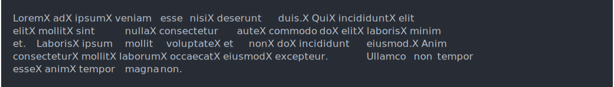

Item text is wrapped to the terminal width:

``` asciicast
cli_ul(c("item 1" = cli:::lorem_paragraph(1, 20),
         "item 2" = cli:::lorem_paragraph(1, 20)))
```

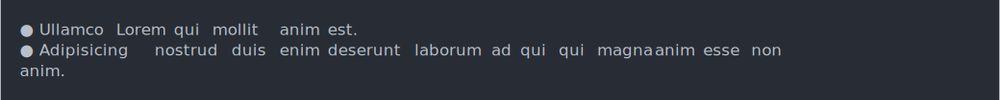

### Adding list items iteratively

Items can be added one by one:

``` asciicast
fun <- function() {
  lid <- cli_ul()
  cli_li("Item 1")
  cli_li("Item 2")
  cli_li("Item 3")
  cli_end(lid)
}
fun()
```


The `cli_ul()` call creates a list container, and because its items are
not specified, it leaves the container open. Then items can be added one
by one. (The last `cli_end()` is not necessary, because by default
containers auto-close when their calling function exits.)

### Adding text to an item iteratively

`cli_li()` creates a new container for the list item, within the list
container. You can keep adding text to the item, until the container is
closed via `cli_end()` or a new `cli_li()`, which closes the current
item container, and creates another one for the new item:

``` asciicast
fun <- function() {
  cli_ul()
  cli_li("First item")
  cli_text("This is still the first item")
  cli_li("This is the second item")
}
fun()
```

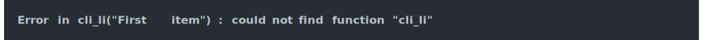

### Nested lists

To create nested lists, open nested containers:

``` asciicast
fun <- function() {
  cli_ol()
  cli_li("Item 1")
  ulid <- cli_ul()
  cli_li("Subitem 1")
  cli_li("Subitem 2")
  cli_end(ulid)
  cli_li("Item 2")
  cli_end()
}
fun()
```


In `cli_end(olid)`, the `olid` is necessary, otherwise `cli_end()` would
only close the container of the list item.

The status bar
--------------

cli supports creating a status bar in the last line of the console, if
the terminal supports the carriage return control character to move the
cursor to the beginning of the line. This is supported in all terminals,
in RStudio, Emacs, RGui, R.app, etc. It is not supported if the output
is a file, e.g. typically on CI systems.

`cli_status()` creates a new status bar, `cli_status_update()` updates a
status bar, and `cli_status_clear()` clears it. `cli_status()` returns
an id, that can be used in `cli_status_update()` and
`cli_status_clear()` to refer to the right status bar.

While it is possible to create multiple status bars, on a typical
terminal only one of them can be shown at any time. cli by default shows
the one that was last created or updated.

While the status bar is active, cli can still produce output, as normal.
This output is created “above” the status bar, which is always kept in
the last line of the screen. See the following example:

``` asciicast
f <- function() {
  cli_alert_info("About to start downloads.")
  sb <- cli_status("{symbol$arrow_right} Downloading 10 files.")
  for (i in 9:1) {
    Sys.sleep(0.5)
    if (i == 5) cli_alert_success("Already half-way!")
    cli_status_update(id = sb,
      "{symbol$arrow_right} Got {10-i} files, downloading {i}")
  }
  cli_status_clear(id = sb)
  cli_alert_success("Downloads done.")
}
f()
```


Theming
=======

The looks of the various CLI elements can be changed via themes. The cli
package comes with a simple built-in theme, and new themes can be added
as well.

Tags, ids and classes
---------------------

Similarly to HTML document, the elements of a CLI form a tree of nodes.
Each node has exactly one tag, at most one id, and optionally a set of
classes. E.g. `cli_par()` creates a node with a `<p>` tag, `cli_ol()`
creates a node with an `<ol>` tag, etc. Here is an example CLI tree. It
always starts with a `<body>` tag with id `"body"`, this is created
automatically.

    <body id="body">
      <par>
        <ol>
          <it>
            <span class="pkg">

A cli theme is a named list, where the names are selectors based on tag
names, ids and classes, and the elements of the list are style
declarations. For example, the style of `<h1>` tags looks like this in
the built-in theme:

``` asciicast
builtin_theme()$h1
```


See also `?cli::themes` for the reference and `?cli::simple_theme` for
an example theme.

Generic containers
------------------

`cli_div()` is a generic container, that does not produce any output,
but it can add a new theme. This theme is removed when the `<div>` node
is closed. (Like other containers, `cli_div()` auto-closes when the
calling function exits.)

``` asciicast
fun <- function() {
  cli_div(theme = list (.alert = list(color = "red")))
  cli_alert("This will be red")
  cli_end()
  cli_alert("Back to normal color")
}
fun()
```

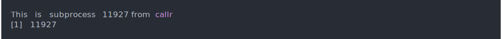

Theming inline markup
---------------------

The inline markup formatters always use a `<span>` tag, and add the name
of the formatter as a class.

``` asciicast
fun <- function() {
  cli_div(theme = list(span.emph = list(color = "orange")))
  cli_text("This is very {.emph important}")
  cli_end()
  cli_text("Back to the {.emph previous theme}")
}
fun()
```

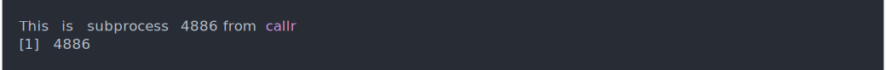

CLI messages
============

All `cli_*()` functions are implemented using standard R conditions. For
example a `cli_alert()` call emits an R condition with class
`cli_message`. These messages can be caught, muffled, transfered from a
subprocess to the main R process.

When a cli function is called:

1.  cli throws a `cli_message` condition.
2.  If this condition is caught and muffled (via the `muffleMessage`
    restart), then nothing else happens.
3.  Otherwise the `cli.default_handler` option is checked and if this is
    a function, then it is called with the message.
4.  If the `cli.default_handler` option is not set, or it is not a
    function, the default cli handler is called, which shows the text,
    alert, heading, etc. on the screen, using the standard R `message()`
    function.

``` asciicast
tryCatch(cli_h1("Heading"), cli_message = function(x) x)
suppressMessages(cli_text("Not shown"))
```


Subprocesses
============

If `cli_*()` commands are invoked in a subprocess via `callr::r_session`
(see <https://callr.r-lib.org>), then they are automatically copied to
the main R process:

``` asciicast
rs <- callr::r_session$new()
rs$run(function() {
  cli::cli_text("This is subprocess {.emph {Sys.getpid()}} from {.pkg callr}")
  Sys.getpid()
})
invisible(rs$close())
```


Utility functions
=================

ANSI colors
-----------

cli defines wrapper functions to the crayon package, to create ANSI
colored and styled output in the console. `col_*` functions change the
foreground color, `bg_*` functions change the background color, and
`style_*` functions change the style of the text in some way.

These functions concatenate their arguments using `paste0()`, and add
the `ansi_string` class to their result:

``` asciicast
cat(col_red("This ", "is ", "red."))
```


Foreground colors:

``` asciicast
cli_ul(c(
  col_black("black"),
  col_blue("blue"),
  col_cyan("cyan"),
  col_green("green"),
  col_magenta("magenta"),
  col_red("red"),
  col_white("white"),
  col_yellow("yellow"),
  col_grey("grey")
))
```

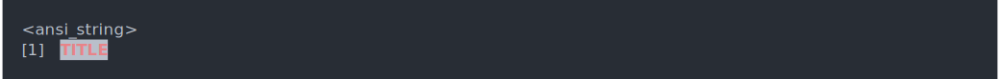

Note that these might actually look different depending on your terminal
theme. Background colors:

``` asciicast
cli_ul(c(
  bg_black("black background"),
  bg_blue("blue background"),
  bg_cyan("cyan background"),
  bg_green("green background"),
  bg_magenta("magenta background"),
  bg_red("red background"),
  bg_white("white background"),
  bg_yellow("yellow background")
))
```


Text styles:

``` asciicast
cli_ul(c(
  style_dim("dim style"),
  style_blurred("blurred style"),
  style_bold("bold style"),
  style_hidden("hidden style"),
  style_inverse("inverse style"),
  style_italic("italic style"),
  style_reset("reset style"),
  style_strikethrough("strikethrough style"),
  style_underline("underline style")
))
```

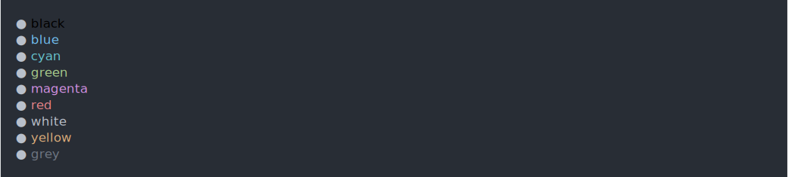

Not all `style_*` functions are supported by all terminals.

Colors, background colors and styles can be combined:

``` asciicast
bg_white(style_bold(col_red("TITLE")))
```

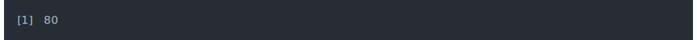

`make_ansi_style()` can create custom colors, assuming your terminal
supports them. `combine_ansi_styles()` combines several styles into a
function:

``` asciicast
col_warn <- combine_ansi_styles(make_ansi_style("pink"), style_bold)
col_warn("This is a warning in pink!")
cat(col_warn("This is a warning in pink!"))
```

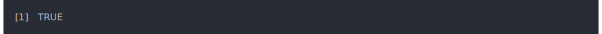

Console capabilities
--------------------

Query the console width:

``` asciicast
console_width()
```


Query if the console supports ansi escapes:

``` asciicast
is_ansi_tty()
```


Hide the cursor, if the console supports it (no-op otherwise):

``` asciicast
ansi_hide_cursor()
ansi_show_cursor()
```


See also `ansi_with_hidden_cursor()`.

Query if the console supports `\r`:

``` asciicast
is_dynamic_tty()
```


Query if the console supports UTF-8 output:

``` asciicast
is_utf8_output()
```


Non-semantic CLI
================

While the primary way of using cli is the `cli_*()` functions that
generate semantic CLI elements, you can also use cli functions that
create terminal output directly.

Unicode characters
------------------

The `symbol` variable includes some Unicode characters that are often
useful in CLI messages. They automatically fall back to ASCII symbols if
the platform does not support them. You can use these symbols both with
the semantic `cli_*()` functions and directly.

``` asciicast
options(asciicast_theme = list(font_family =
  c("Monaco", "'Fira Code'", "Consolas", "Menlo",
    "'Bitstream Vera Sans Mono'", "'Powerline Symbols'", "monospace")))
```


``` asciicast
cli_text("{symbol$tick} no errors  |  {symbol$cross} 2 warnings")
```


Here is a list of all symbols:

``` asciicast
list_symbols()
```


Most symbols were inspired by (and copied from) the awesome
[figures](https://github.com/sindresorhus/figures) JavaScript project.

Rules
-----

### Simple rule, double rule, bars

``` asciicast
rule()
```

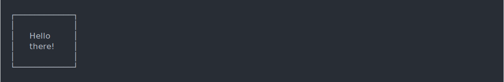

``` asciicast
rule(line = 2)
```


``` asciicast
rule(line = "bar2")
```

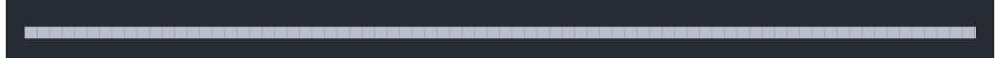

``` asciicast
rule(line = "bar5")
```


``` asciicast
rule(center = "TITLE", line = "~")
```

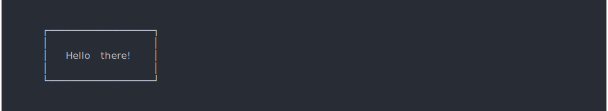

### Labels

``` asciicast
rule(left = "Results")
```


``` asciicast
rule(center = " * RESULTS * ")
```


### Colors

``` asciicast
rule(center = col_red(" * RESULTS * "))
```


``` asciicast
rule(center = " * RESULTS * ", col = "red")
```


``` asciicast
rule(center = " * RESULTS * ", line_col = "red")
```


``` asciicast
rule(center = "TITLE", line = "~-", line_col = "blue")
```

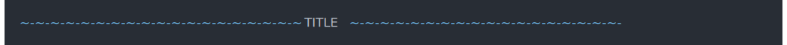

``` asciicast
rule(center = bg_red(" ", symbol$star, "TITLE", symbol$star, " "),
  line = "\u2582", line_col = "orange")
```

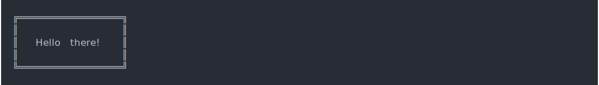

Boxes
-----

``` asciicast
boxx("Hello there!")
```


### Change border style

``` asciicast
boxx("Hello there!", border_style = "double")
```


### Multiple lines of text

``` asciicast
boxx(c("Hello", "there!"), padding = 1)
```


### Padding and margin

``` asciicast
boxx("Hello there!", padding = 1)
```

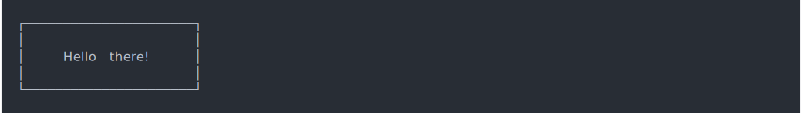

``` asciicast
boxx("Hello there!", padding = c(1, 5, 1, 5))
```


``` asciicast
boxx("Hello there!", margin = 1)
```


``` asciicast
boxx("Hello there!", margin = c(1, 5, 1, 5))
```


### Floating

``` asciicast
boxx("Hello there!", padding = 1, float = "center")
```


``` asciicast
boxx("Hello there!", padding = 1, float = "right")
```


### Colors

``` asciicast
boxx(col_cyan("Hello there!"), padding = 1, float = "center")
```

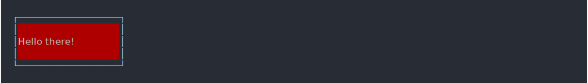

``` asciicast
boxx("Hello there!", padding = 1, background_col = "brown")
```


``` asciicast
boxx("Hello there!", padding = 1, background_col = bg_red)
```

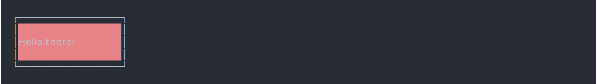

``` asciicast
boxx("Hello there!", padding = 1, border_col = "green")
```


``` asciicast
boxx("Hello there!", padding = 1, border_col = col_red)
```


### Label alignment

``` asciicast
boxx(c("Hi", "there", "you!"), padding = 1, align = "left")
```

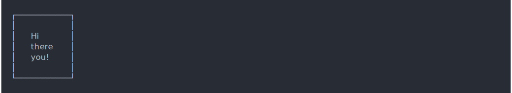

``` asciicast
boxx(c("Hi", "there", "you!"), padding = 1, align = "center")
```

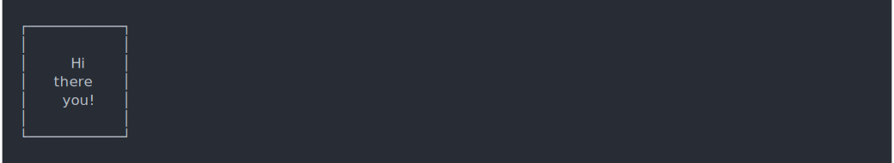

``` asciicast
boxx(c("Hi", "there", "you!"), padding = 1, align = "right")
```

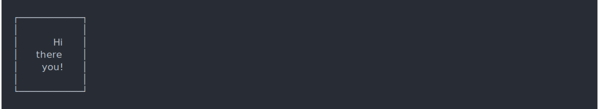

### A very customized box

``` asciicast
star <- symbol$star
label <- c(paste(star, "Hello", star), "  there!")
boxx(
  col_white(label),
  border_style="round",
  padding = 1,
  float = "center",
  border_col = "tomato3",
  background_col="darkolivegreen"
)
```


Trees
-----

You can specify the tree with a two column data frame, containing the
node ids/labels, and the list of their children.

``` asciicast
data <- data.frame(
  stringsAsFactors = FALSE,
  package = c("processx", "backports", "assertthat", "Matrix",
    "magrittr", "rprojroot", "clisymbols", "prettyunits", "withr",
    "desc", "igraph", "R6", "crayon", "debugme", "digest", "irlba",
    "rcmdcheck", "callr", "pkgconfig", "lattice"),
  dependencies = I(list(
    c("assertthat", "crayon", "debugme", "R6"), character(0),
    character(0), "lattice", character(0), "backports", character(0),
    c("magrittr", "assertthat"), character(0),
    c("assertthat", "R6", "crayon", "rprojroot"),
    c("irlba", "magrittr", "Matrix", "pkgconfig"), character(0),
    character(0), "crayon", character(0), "Matrix",
    c("callr", "clisymbols", "crayon", "desc", "digest", "prettyunits",
      "R6", "rprojroot", "withr"),
    c("processx", "R6"), character(0), character(0)
  ))
)
tree(data, root = "rcmdcheck")
```

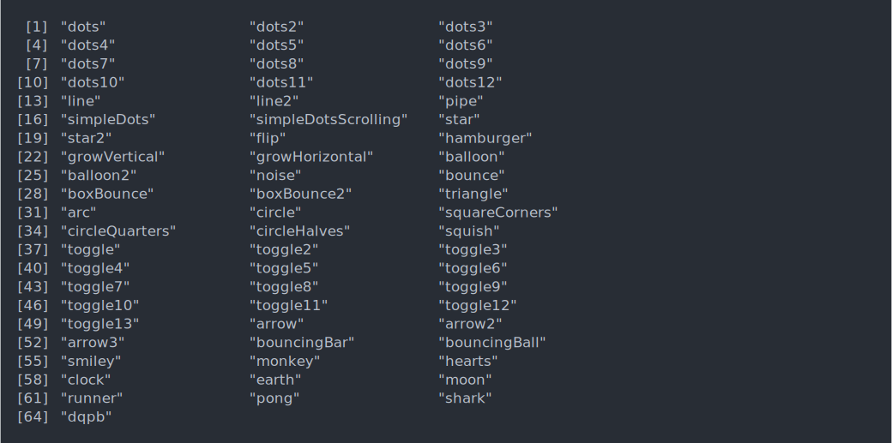

An optional third column may contain custom labels. These can be colored
as well:

``` asciicast
data$label <- paste(data$package,
  col_grey(paste0("(", c("2.0.0.1", "1.1.1", "0.2.0", "1.2-11",
    "1.5", "1.2", "1.2.0", "1.0.2", "2.0.0", "1.1.1.9000", "1.1.2",
    "2.2.2", "1.3.4", "1.0.2", "0.6.12", "2.2.1", "1.2.1.9002",
    "1.0.0.9000", "2.0.1", "0.20-35"), ")"))
  )
roots <- ! data$package %in% unlist(data$dependencies)
data$label[roots] <- col_cyan(style_italic(data$label[roots]))
tree(data, root = "rcmdcheck")
```


Spinners
--------

See `list_spinners()` and `get_spinner()`. From the awesome
[cli-spinners](https://github.com/sindresorhus/cli-spinners#readme)
project.

``` asciicast
list_spinners()
```


``` asciicast
get_spinner("dots")
```

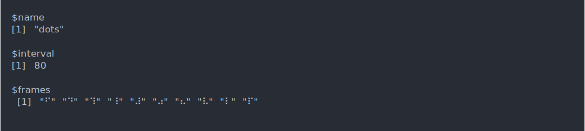

``` asciicast
ansi_with_hidden_cursor(demo_spinners("dots"))
```


``` asciicast
ansi_with_hidden_cursor(demo_spinners("clock"))
```


License
=======

MIT © RStudio
