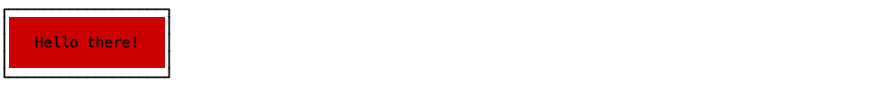
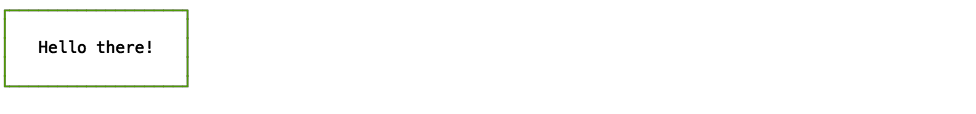
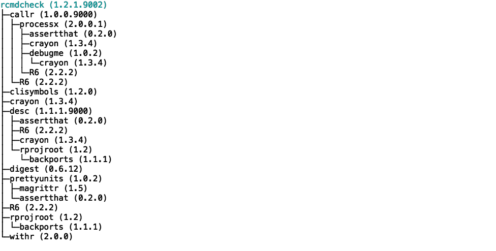

# cli

> Draw Boxes, Rules, Trees in the R Console

[](https://travis-ci.org/r-lib/cli)
[](https://ci.appveyor.com/project/gaborcsardi/cli)
[](http://www.r-pkg.org/pkg/cli)
[](http://www.r-pkg.org/pkg/cli)
[](https://coveralls.io/r/r-lib/cli?branch=master)

It integrates well with `crayon` for coloring the boxes or their content,
and `clisymbols` to include Unicode characters in the boxes. It can also
draw rules to make headers or footers in console output, and tree
structures.

## Installation

```r
devtools::install_github("r-lib/cli")
```

## Usage


```r
library(cli)
```


### Rules

Simple rule


```r
rule()
```


Double rule


```r
rule(line = 2)
```


Bars


```r
rule(line = "bar2")
```


```r
rule(line = "bar5")
```


Left label


```r
rule(left = "Results")
```


Centered label


```r
rule(center = " * RESULTS * ")
```


Colored labels


```r
rule(center = crayon::red(" * RESULTS * "))
```


Colored line


```r
rule(center = crayon::red(" * RESULTS * "), line_color = "red")
```


Custom line


```r
rule(center = "TITLE", line = "~")
```


More custom line


```r
rule(center = "TITLE", line = crayon::blue("~-"))
```


Even more custom line


```r
rule(center = crayon::bgRed(" ", clisymbols::symbol$star, "TITLE",
  clisymbols::symbol$star, " "),
  line = "\u2582",
  line_color = "orange")
```


### Boxes

Default box


```r
boxx("Hello there!")
```


Change border style


```r
boxx("Hello there!", border_style = "double")
```


Multiple lines


```r
boxx(c("Hello", "there!"), padding = 1)
```


Padding


```r
boxx("Hello there!", padding = 1)
```


```r
boxx("Hello there!", padding = c(1, 5, 1, 5))
```


Margin


```r
boxx("Hello there!", margin = 1)
```


```r
boxx("Hello there!", margin = c(1, 5, 1, 5))
```


```r
boxx("Hello there!", padding = 1, margin = c(1, 5, 1, 5))
```


Floating


```r
boxx("Hello there!", padding = 1, float = "center")
```


```r
boxx("Hello there!", padding = 1, float = "right")
```


Text color


```r
boxx(crayon::cyan("Hello there!"), padding = 1, float = "center")
```


Backgorund color


```r
boxx("Hello there!", padding = 1, background_color = "brown")
```


```r
boxx("Hello there!", padding = 1, background_color = crayon::bgRed)
```



Border color


```r
boxx("Hello there!", padding = 1, border_color = "green")
```



```r
boxx("Hello there!", padding = 1, border_color = crayon::red)
```


Label alignment


```r
boxx(c("Hi", "there", "you!"), padding = 1, align = "left")
```


```r
boxx(c("Hi", "there", "you!"), padding = 1, align = "center")
```


```r
boxx(c("Hi", "there", "you!"), padding = 1, align = "right")
```


A very customized box


```r
star <- clisymbols::symbol$star
label <- c(paste(star, "Hello", star), "  there!")
boxx(
  crayon::white(label),
  border_style="round",
  padding = 1,
  float = "center",
  border_color = "tomato3",
  background_color="darkolivegreen"
)
```


### Trees

You can specify the tree with a two column data frame, containing the
node ids/labels, and the list of their children.


```r
data <- data.frame(
  stringsAsFactors = FALSE,
  package = c("processx", "backports", "assertthat", "Matrix",
    "magrittr", "rprojroot", "clisymbols", "prettyunits", "withr",
    "desc", "igraph", "R6", "crayon", "debugme", "digest", "irlba",
    "rcmdcheck", "callr", "pkgconfig", "lattice"),
  dependencies = I(list(
    c("assertthat", "crayon", "debugme", "R6"), character(0),
    character(0), "lattice", character(0), "backports", character(0),
    c("magrittr", "assertthat"), character(0),
    c("assertthat", "R6", "crayon", "rprojroot"),
    c("irlba", "magrittr", "Matrix", "pkgconfig"), character(0),
    character(0), "crayon", character(0), "Matrix",
    c("callr", "clisymbols", "crayon", "desc", "digest", "prettyunits",
      "R6", "rprojroot", "withr"),
    c("processx", "R6"), character(0), character(0)
  ))
)
tree(data, root = "rcmdcheck")
```


An optional third column may contain custom labels. These can be colored
as well:


```r
data$label <- paste(data$package,
  crayon::blurred(paste0("(", c("2.0.0.1", "1.1.1", "0.2.0", "1.2-11",
    "1.5", "1.2", "1.2.0", "1.0.2", "2.0.0", "1.1.1.9000", "1.1.2",
    "2.2.2", "1.3.4", "1.0.2", "0.6.12", "2.2.1", "1.2.1.9002",
    "1.0.0.9000", "2.0.1", "0.20-35"), ")"))
  )
roots <- ! data$package %in% unlist(data$dependencies)
data$label[roots] <- crayon::cyan(crayon::italic(data$label[roots]))
tree(data, root = "rcmdcheck")
```



## License

MIT © RStudio
