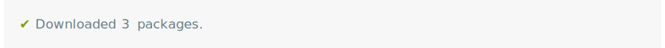
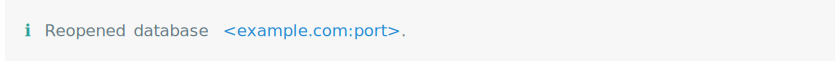
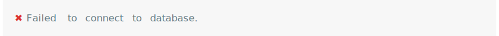
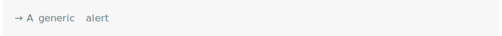
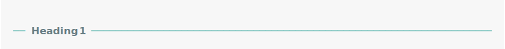
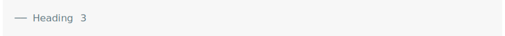
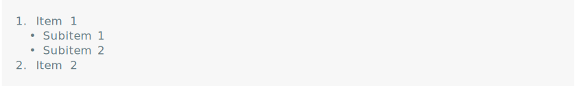
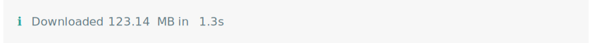
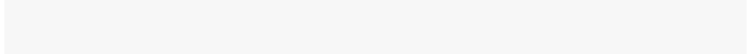

<!-- README.md is generated from README.Rmd. Please edit that file -->

cli
===

> Helpers for Developing Command Line Interfaces

<!-- badges: start -->

[](https://github.com/r-lib/cli/actions)
[](https://www.r-pkg.org/pkg/cli)
[](https://www.r-pkg.org/pkg/cli)
[](https://codecov.io/github/r-lib/cli?branch=main)
<!-- badges: end -->

A suite of tools to build attractive command line interfaces (CLIs),
from semantic elements: headers, lists, alerts, paragraphs, etc.
Supports theming via a CSS-like language. It also contains a number of
lower level CLI elements: rules, boxes, trees, and Unicode symbols with
ASCII alternatives. It supports ANSI markup for terminal colors and font
styles.

------------------------------------------------------------------------

Features
========

-   Build a CLI using semantic elements: headings, lists, alerts,
    paragraphs.
-   Theming via a CSS-like language.
-   Terminal colors and font styles.
-   All cli text can contain interpreted string literals, via the
    [glue](https://github.com/tidyverse/glue) package.
-   Progress bars from R and C code.
-   Error and warning messages with rich text formatting.
-   Support for pluralized messages.
-   ANSI styled string manipulation.

Installation
============

Install the stable version from CRAN:

``` r
install.packages("cli")
```

Short tour
----------

Some of the more commonly used cli elements, and features.

### Short alert messages

One liner messages to inform or warn.

``` r
pkgs <- c("foo", "bar", "foobar")
cli_alert_success("Downloaded {length(pkgs)} packages.")
```



``` r
db_url <- "example.com:port"
cli_alert_info("Reopened database {.url {db_url}}.")
```



``` r
cli_alert_warning("Cannot reach GitHub, using local database cache.")
```


``` r
cli_alert_danger("Failed to connect to database.")
```



``` r
cli_alert("A generic alert")
```



### Headings

Three levels of headings.

``` r
cli_h1("Heading 1")
```



``` r
cli_h2("Heading 2")
```


``` r
cli_h3("Heading 3")
```



### Lists

Ordered, unordered and description lists, that can be nested.

``` r
fun <- function() {
  cli_ol()
  cli_li("Item 1")
  ulid <- cli_ul()
  cli_li("Subitem 1")
  cli_li("Subitem 2")
  cli_end(ulid)
  cli_li("Item 2")
  cli_end()
}
fun()
```



### Themes

Theming via a CSS-like language.

``` r
fun <- function() {
  cli_div(theme = list(span.emph = list(color = "orange")))
  cli_text("This is very {.emph important}")
  cli_end()
  cli_text("Back to the {.emph previous theme}")
}
fun()
```


### Command substitution

Automatic command substitution via the
[glue](https://github.com/tidyverse/glue) package.

``` r
size <- 123143123
dt <- 1.3454
cli_alert_info(c(
  "Downloaded {prettyunits::pretty_bytes(size)} in ",
  "{prettyunits::pretty_sec(dt)}"))
```



### Pluralization

Pluralization support.

``` r
nfiles <- 3
ndirs <- 1
cli_alert_info("Found {nfiles} file{?s} and {ndirs} director{?y/ies}.")
```


### Progress bars

``` r
clean <- function() {
  cli_progress_bar("Cleaning data", total = 100)
  for (i in 1:100) {
    Sys.sleep(5/100)
    cli_progress_update()
  }
}
clean()
```



Documentation
-------------

See at
[`https://cli.r-lib.org/`](https://cli.r-lib.org/reference/index.html)
and also in the installed package: `help(package = "cli")`.

License
=======

MIT © RStudio
