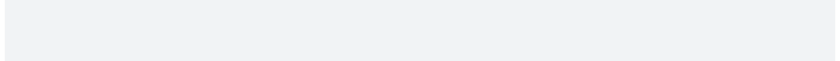

# Character vector to put a spinner on the screen

`cli` contains many different spinners, you choose one according to your
taste.

## Usage

``` r
get_spinner(which = NULL)
```

## Arguments

- which:

  The name of the chosen spinner. If `NULL`, then the default is used,
  which can be customized via the `cli.spinner_unicode`,
  `cli.spinner_ascii` and `cli.spinner` options. (The latter applies to
  both Unicode and ASCII displays. These options can be set to the name
  of a built-in spinner, or to a list that has an entry called `frames`,
  a character vector of frames.

## Value

A list with entries: `name`, `interval`: the suggested update interval
in milliseconds and `frames`: the character vector of the spinner's
frames.

## Details

    options(cli.spinner = "hearts")
    fun <- function() {
      cli_progress_bar("Spinning")
      for (i in 1:100) {
        Sys.sleep(4/100)
        cli_progress_update()
      }
    }
    fun()
    options(cli.spinner = NULL)



## See also

Other spinners:
[`demo_spinners()`](https://cli.r-lib.org/reference/demo_spinners.md),
[`list_spinners()`](https://cli.r-lib.org/reference/list_spinners.md),
[`make_spinner()`](https://cli.r-lib.org/reference/make_spinner.md)
