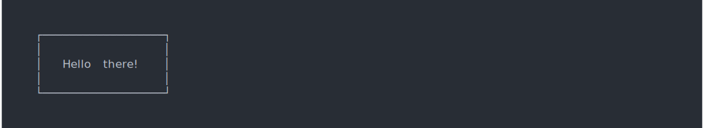

```r
library(cli)
```

# Introduction

These are non-semantic functions to format or output content to the
console. They do not use the cli theme.

# Rules

`rule()` creates a horizontal rule, potentially with labels.
If you are building a semantic CLI, then consider using `cli_rule()`
instead.

## Simple rule, double rule, bars


```asciicast
rule()
```


```asciicast
rule(line = 2)
```


```asciicast
rule(line = "bar2")
```


```asciicast
rule(line = "bar5")
```


```asciicast
rule(center = "TITLE", line = "~")
```


## Labels


```asciicast
rule(left = "Results")
```


```asciicast
rule(center = " * RESULTS * ")
```


## Colors


```asciicast
rule(center = col_red(" * RESULTS * "))
```


```asciicast
rule(center = " * RESULTS * ", col = "red")
```


```asciicast
rule(center = " * RESULTS * ", line_col = "red")
```


```asciicast
rule(center = "TITLE", line = "~-", line_col = "blue")
```


```asciicast
rule(center = bg_red(" ", symbol$star, "TITLE", symbol$star, " "),
  line = "\u2582", line_col = "orange")
```


# Boxes


```asciicast
boxx("Hello there!")
```


## Change border style


```asciicast
boxx("Hello there!", border_style = "double")
```


## Multiple lines of text


```asciicast
boxx(c("Hello", "there!"), padding = 1)
```


## Padding and margin


```asciicast
boxx("Hello there!", padding = 1)
```


```asciicast
boxx("Hello there!", padding = c(1, 5, 1, 5))
```


```asciicast
boxx("Hello there!", margin = 1)
```





```asciicast
boxx("Hello there!", margin = c(1, 5, 1, 5))
```


## Floating


```asciicast
boxx("Hello there!", padding = 1, float = "center")
```


```asciicast
boxx("Hello there!", padding = 1, float = "right")
```


## Colors


```asciicast
boxx(col_cyan("Hello there!"), padding = 1, float = "center")
```


```asciicast
boxx("Hello there!", padding = 1, background_col = "brown")
```


```asciicast
boxx("Hello there!", padding = 1, background_col = bg_red)
```


```asciicast
boxx("Hello there!", padding = 1, border_col = "green")
```


```asciicast
boxx("Hello there!", padding = 1, border_col = col_red)
```


## Label alignment


```asciicast
boxx(c("Hi", "there", "you!"), padding = 1, align = "left")
```


```asciicast
boxx(c("Hi", "there", "you!"), padding = 1, align = "center")
```


```asciicast
boxx(c("Hi", "there", "you!"), padding = 1, align = "right")
```


## A very customized box


```asciicast
star <- symbol$star
label <- c(paste(star, "Hello", star), "  there!")
boxx(
  col_white(label),
  border_style="round",
  padding = 1,
  float = "center",
  border_col = "tomato3",
  background_col="darkolivegreen"
)
```


# Trees

You can specify the tree with a two column data frame, containing the
node ids/labels, and the list of their children.


```asciicast
data <- data.frame(
  stringsAsFactors = FALSE,
  package = c("processx", "backports", "assertthat", "Matrix",
    "magrittr", "rprojroot", "clisymbols", "prettyunits", "withr",
    "desc", "igraph", "R6", "crayon", "debugme", "digest", "irlba",
    "rcmdcheck", "callr", "pkgconfig", "lattice"),
  dependencies = I(list(
    c("assertthat", "crayon", "debugme", "R6"), character(0),
    character(0), "lattice", character(0), "backports", character(0),
    c("magrittr", "assertthat"), character(0),
    c("assertthat", "R6", "crayon", "rprojroot"),
    c("irlba", "magrittr", "Matrix", "pkgconfig"), character(0),
    character(0), "crayon", character(0), "Matrix",
    c("callr", "clisymbols", "crayon", "desc", "digest", "prettyunits",
      "R6", "rprojroot", "withr"),
    c("processx", "R6"), character(0), character(0)
  ))
)
tree(data, root = "rcmdcheck")
```


An optional third column may contain custom labels. These can be colored
as well:


```asciicast
data$label <- paste(data$package,
  col_grey(paste0("(", c("2.0.0.1", "1.1.1", "0.2.0", "1.2-11",
    "1.5", "1.2", "1.2.0", "1.0.2", "2.0.0", "1.1.1.9000", "1.1.2",
    "2.2.2", "1.3.4", "1.0.2", "0.6.12", "2.2.1", "1.2.1.9002",
    "1.0.0.9000", "2.0.1", "0.20-35"), ")"))
  )
roots <- ! data$package %in% unlist(data$dependencies)
data$label[roots] <- col_cyan(style_italic(data$label[roots]))
tree(data, root = "rcmdcheck")
```


