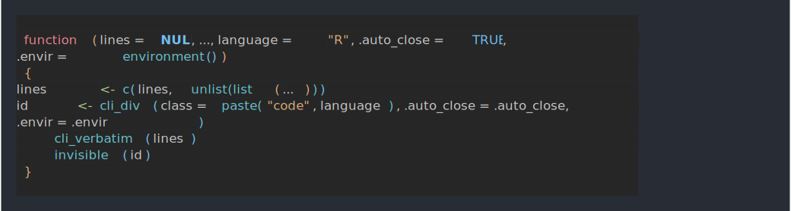

```r
library(cli)
library(usethis)
```

# Introduction

We'll show how to transition from the `usethis::ui_*` functions to
cli 2.0.0.

# How to 

## `usethis::ui_code()`

```
usethis::ui_code(x)
```


```asciicast
ui_todo("Redocument with {ui_code('devtools::document()')}")
```


In general inline code formatting can be done with inline styles in cli.
The default theme has a `"code"` class, but it also one for functions,
so this can be either of:


```asciicast
cli_ul("Redocument with {.code devtools::document()}")
```


```asciicast
cli_ul("Redocument with {.fun devtools::document}")
```


## `usethis::ui_code_block()`

```
usethis::ui_code_block(x, copy = interactive(), .envir = parent.frame())
```


```asciicast
ui_code_block("{format(cli_code)}")
```


`cli_code()` produces similar output and it also syntax highlight R code:


```asciicast
cli_code(format(cli_code))
```




However, cli does not copy stuff to the clipboard, so this has to be done
separately.

Another difference is that it also does not run glue substitutions on
the code text, so if you want that to happen you'll need to do that
before the cli call.

## `usethis::ui_done()`

```
usethis::ui_done(x, .envir = parent.frame())
```


```asciicast
name <- "VignetteBuilder"
value <- "knitr, rmarkdown"
ui_done("Setting {ui_field(name)} field in DESCRIPTION to {ui_value(value)}")
```


This is probably closest to `cli_alert_success()`:


```asciicast
cli_alert_success("Setting {.field {name}} field in DESCRIPTION to {.val {value}}")
```


If you want to handle success and failure, then maybe the `cli_process_*()`
functions are a better fit:


```asciicast
tryCatch({
    cli_process_start("Setting {.field {name}} field in DESCRIPTION to {.val {value}}")
    Sys.sleep(1) # <- do the task here, we just sleep
    cli_process_done() },
  error = function(err) {
    cli_process_failed()
    cli_alert_danger("Failed to ...")
  }
)
```


## `usethis::ui_field()`

```
usethis::ui_field(x)
```


```asciicast
name <- "VignetteBuilder"
value <- "knitr, rmarkdown"
ui_done("Setting {ui_field(name)} field in DESCRIPTION to {ui_value(value)}")
```


cli has a `"field"` class for inline styling:


```asciicast
cli_alert_success("Setting {.field {name}} field in DESCRIPTION to {.val {value}}")
```


Just like `usethis::ui_field()` and similar usethis functions, cli collapses
inline vectors, before styling:


```asciicast
name <- c("Depends", "Imports", "Suggests")
ui_done("Setting the {ui_field(name)} field(s) in DESCRIPTION")
```


```asciicast
cli_alert_success("Setting the {.field {name}} field{?s} in DESCRIPTION")
```


cli also helps you with the correct pluralization:


```asciicast
name <- "Depends"
cli_alert_success("Setting the {.field {name}} field{?s} in DESCRIPTION")
```


## `usethis::ui_info()`

```
usethis::ui_info((x, .envir = parent.frame())
```


```asciicast
ui_info("No labels need renaming")
```


This is simply `cli_alert_info()`:


```asciicast
cli_alert_info("No labels need renaming")
```


## `usethis::ui_line()`

```
usethis::ui_line(x, .envir = parent.frame())
```


```asciicast
ui_line("No matching issues/PRs found.")
```


This is just a line of text, so `cli_text()` is fine for this. One difference
is that `cli_text()` will automatically wrap the long lines.


```asciicast
cli_text("No matching issues/PRs found.")
```


## `usethis::ui_nope()`

```
ui_nope(x, .envir = parent.frame())
```

cli does not support user input currently, so this has to stay in usethis.

## `usethis::ui_oops()`

```
usethis::ui_oops(x, .envir = parent.frame())
```


```asciicast
ui_oops("Can't validate token. Is the network reachable?")
```


This is mostly just `cli_alert_danger()`, but for see also the
`cli_process_*()` alternatives at `usethis::ui_done()`.

## `usethis::ui_path()`

```
usethis::ui_path(x, base = NULL)
```

`ui_path()` formats paths as relative to the project or the supplied
base directory, and also appends a `/` to directories. cli does not do
any of these, but it does have inline markup for files and paths:


```asciicast
logo_path <- file.path("man", "figures", "logo.svg")
img <- "/tmp/some-image.svg"
ui_done("Copied {ui_path(img)} to {ui_path(logo_path)}")
```


```asciicast
cli_alert_success("Copied {.file {img}} to {.file {logo_path}}")
```


## `usethis::ui_stop()`

```
usethis::ui_stop(x, .envir = parent.frame())
```

`ui_stop()` does glue substitution on the string, and then calls `stop()`
to throw an error.

cli does not have any tools to throw errors currently.

## `usethis::ui_todo()`

```
usethis::ui_todo(x, .envir = parent.frame())
```

This is a bullet, so either `cli_ul()` or `cli_alert_info()` should be
appropriate:


```asciicast
ui_todo("Redocument with {ui_code('devtools::document()')}")
```


```asciicast
cli_ul("Redocument with {.fun devtools::document}")
```


## `usethis::ui_value()`

```
usethis::ui_value(x)
```

The `"value"` inline class is appropriate for this.


```asciicast
name <- "VignetteBuilder"
value <- "knitr, rmarkdown"
ui_done("Setting {ui_field(name)} field in DESCRIPTION to {ui_value(value)}")
```


```asciicast
cli_alert_success("Setting {.field {name}} field in DESCRIPTION to {.val {value}}")
```


## `usethis::ui_warn()`

```
usethis::ui_warn(x, .envir = parent.frame())
```

`ui_warn()` does glue substitution on the string, and then calls `warning()`
to throw a warning.

cli does not have any tools to throw warnings currently.

## `usethis::ui_yeah()`

```
ui_yeah(x, .envir = parent.frame())
```

cli does not support user input currently, so this has to stay in usethis.
